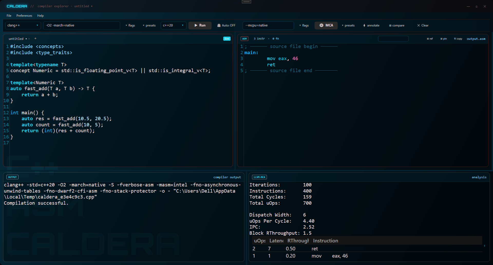
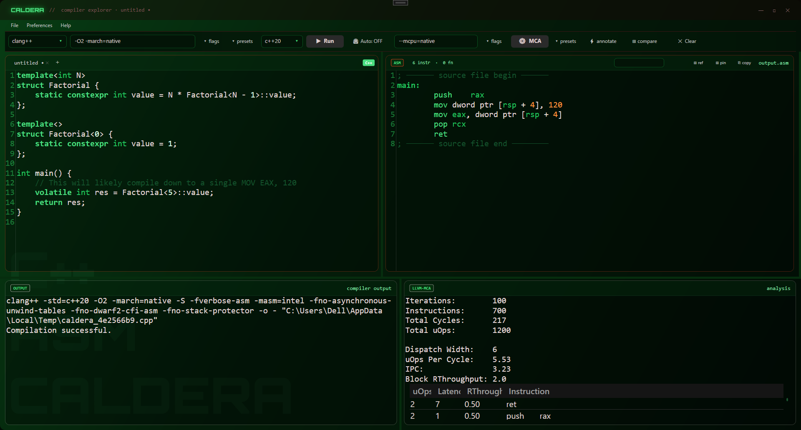
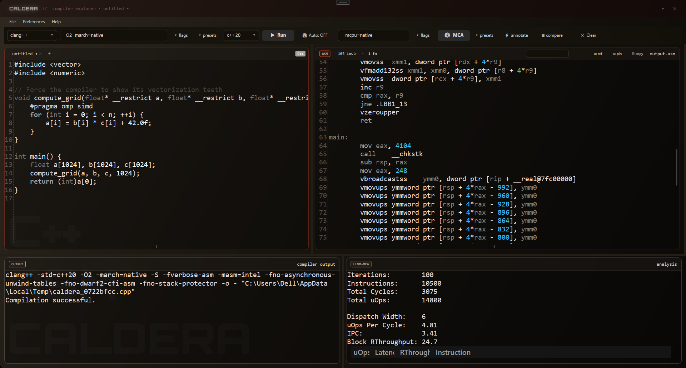
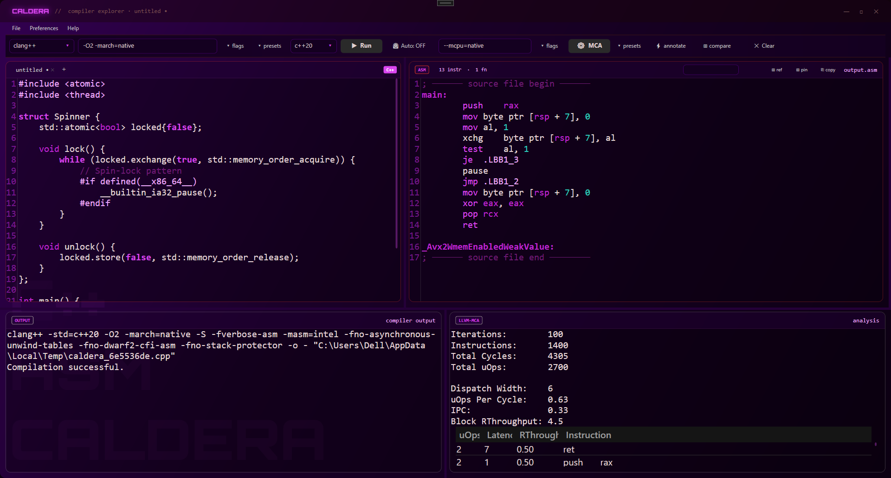
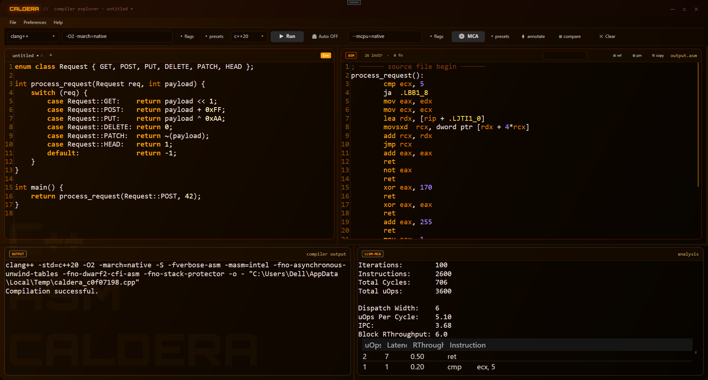
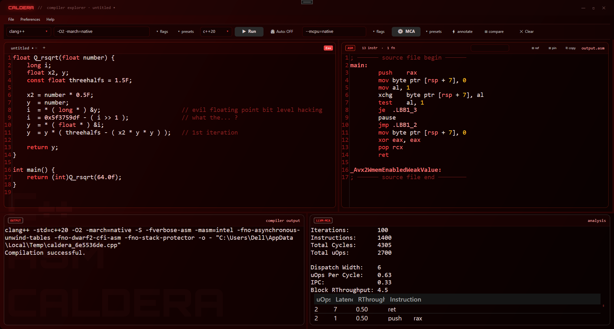

# Caldera

A native Windows C++ → ASM inspection IDE. Write code, see machine output instantly — no browser, no round-trips, no noise.

## Compilers

Caldera drives **clang++**, **g++**, **cl.exe** (MSVC), and **nvcc** (CUDA) directly from your local toolchain. The compiler, C++ standard (`c++17` / `c++20` / `c++23`), and flags are all independently configurable per user tab. 
MSVC is auto-discovered via `vswhere` and `vcvars64.bat` — no manual environment setup required. 
Cross-compilation is frictionless: Caldera automatically maps `C:\` paths to internal WSL `/mnt/c/` filesystem mounts to invoke Linux binaries seamlessly.
 

## Source → ASM pipeline

Your code is silently wrapped in compiler-specific sentinel markers before compilation, so only your code's assembly appears in the output pane — no CRT boilerplate, no wrapper noise.

- **clang++ / g++**: uses `volatile asm("# CALDERA_BEGIN")` markers that survive all optimisation levels
- **MSVC**: uses `extern "C" __declspec(noinline)` sentinel functions whose unmangled `PROC`/`ENDP` labels make extraction exact
- **Windows clang (MSVC ABI)**: detected automatically; full output is used with direct formatter cleanup instead of sentinel extraction, which is unreliable on COFF targets
- **NVCC (CUDA)**: depending on flags, generates raw parallel-thread execution logic (`-ptx`), or invokes `nvdisasm -g` asynchronously against `.cubin` intermediaries to generate raw NVIDIA SASS output.

The raw ASM is then run through a Compiler Explorer-style formatter that strips GAS directives, CFI annotations, source-location comments, MSVC offset annotations, constant-pool labels, and DWARF tokens. Function labels are demangled inline — both Itanium ABI (`_Z...`) and MSVC decorated names (`?...@@...`) are decoded to readable `function(arg, arg):` form.

## Source ↔ ASM highlighting

Hover or click any line in the source editor and the corresponding ASM instructions highlight in the output pane, and vice versa. The mapping is built from compiler-emitted source-location tags (`# file:line:` for GCC/clang, `; Line N` for MSVC) and remapped to display-ASM line numbers after formatting. On Windows clang (which emits no source tags), the mapping falls back to function-name matching.

## Pin & diff

**⊞ pin** snapshots the current ASM output as a baseline. Utilizing an embedded **Myers LCS (Longest Common Subsequence)** diff engine coupled with AvalonEdit background-renderers, additions and deletions are gracefully highlighted softly underneath the text bounds, rather than resorting to archaic character prefixing. 

## llvm-mca integration

**MCA** runs `llvm-mca` on the current ASM output. The raw terminal data is structurally consumed and displayed inside a native WPF `DataGrid` detailing precise instruction throughput, cyclic latency overlays, and uOp metrics. **⚡ annotate** injects per-instruction MCA annotations directly into the ASM pane for inline reading. MSVC output is sanitized (hex literals converted, mangled names stripped, MASM syntax cleaned) before being passed to MCA, which expects AT&T/Intel GAS syntax.

## Opcode reference panel

**⊞ ref** opens a sliding panel with a searchable opcode database. Each entry includes a one-line summary, category, flags read/written, encoding forms with operand types and opcode bytes, a multi-sentence description, exception classes, and per-microarchitecture latency and reciprocal throughput data. Double-clicking an instruction in the ASM pane jumps directly to its entry.

## Flag picker & presets

The flag picker surfaces common compiler flags grouped by category (optimisation, architecture, sanitizers, etc.) as toggleable chips. Named presets can be saved and recalled from the toolbar for both compiler flags and MCA flags independently.

## Multi-compiler compare

**⊞ compare** compiles the current source simultaneously with all configured compilers and displays the outputs concatenated with labelled separators — useful for a quick three-way clang/g++/MSVC comparison in a single pass.

## Search & Export

A syntax-query AvalonEdit search engine parses instruction definitions, radiating inline highlights asynchronously when mapping assembly matches.
A standalone Session Exporter packages every attribute of the active tab (C++ code, standard rules, architectures, flags, generated assembly outputs, and parsed MCA blocks) flawlessly into standalone `Markdown` reports or beautifully-styled `HTML` pages.

## Tabs & Auto-Compile

Multiple independent editor sessions run in tabs, each maintaining its own background isolation and configurations. Code changes track an unsaved `•` marker, and workspaces persist completely natively into `%APPDATA%\Caldera\session.json`. You can utilize the built in **⏲ Auto** toggle to perform a 600ms delayed background dispatcher compilation asynchronously as you type.
 

## Themes

Six premium dark-mode themes cover both the C++ source editor and the ASM output pane: **Bloodshed** (Corium), **Outerspace**, **Slipstream**, **Amber Steel** (Spectra), **Zenith**, and **Hailstorm** (StormSTL). Each theme defines accent, background, text, and dim-text colours applied consistently across the full UI. Font family and size are independently configurable for the source and output panes.

## Keyboard shortcuts

| Shortcut | Action |
|---|---|
| `Ctrl+Enter` | Compile and run |
| `Ctrl+T` | New tab |
| `Ctrl+W` | Close tab |
| `Ctrl+S` | Save |
| `Ctrl+O` | Open |

## Requirements

- Windows 10/11, .NET 8
- At least one of: clang++, g++ (MinGW/MSYS2), or MSVC (Visual Studio 2017–2022)
- llvm-mca (optional, for MCA features) — path configurable in Preferences
